# :construction: Pixel Artist - ALPHA :construction:

Create Pixel Art from input pictures

## Introduction

The purpose of this Typescript node.js library is to transform pictures by adding a Pixel-Art touch.

The library has only one dependency on [Jimp](https://www.npmjs.com/package/jimp) (used to import/export picture files).

## Features

Different operations are available, which can be combined in a single rendering.

### Arbitrary palettes

All transformations use colors exclusively from an arbitrary palette. The palette can be defined as a list of colors and/or as RGB bit depths. Some **well-known predefined palettes** are available:

|Name|#Colors|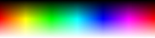|
|--|--|--|
|CPC|27|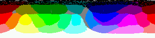|
|AAP64|64|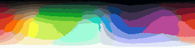|
|Apple2|15||
|CGA|16|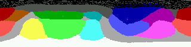|
|C64|16||
|Fantasy24|24|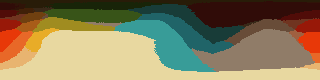|
|Jewel15|15||
|MSX|15||
|NES|53|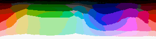|
|RGB|16777216||
|RGB332|256|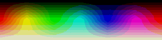|
|RGB444|4096|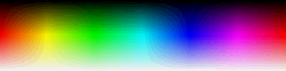|
|RGB565|65536|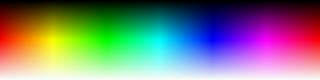|
|Spectrum|15|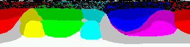|
|Steam16|16|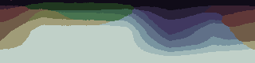|
|Sweetie16|16||
|Tandy|59|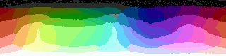|
|Teletext|8|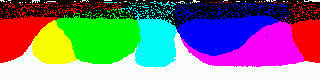|
|VIC20|16||


### Outline

An outline can be added around the non-transparent part of the image according to 2 variants.

The first variant creates a single-pixel outline, including diagonals:

The outline created by the second variant connects the pixels in diagonal:


In addition, the thickness of the outline can be set, e.g. 3 pixels on first variant:


### Edge


### Dithering


## API

The complete API of the library is available in [doc](doc/modules/_pixel_artist_.html). The main classes are:

- [`Color`](doc/classes/_pixel_artist_.color.html): RGBA color in sRGB space with CIELAB distance
- [`Palette`](doc/classes/_pixel_artist_.palette.html): Palette based on bit depth and/or list of colors
- [`PixelArtist`](doc/classes/_pixel_artist_.pixelartist.html): Picture transformation object


## Usage in node.js with Typescript

The library is distributed primarily as an CommonJS module in an `npm` package. First of all, install the module in your project:

`npm install pixel-art --save` to use the library as part of the project at run-time
  or
`npm install pixel-art --save-dev` to use it as development dependency

A typical Typescript usage looks like:

```typescript
import Jimp from 'jimp';
import {PixelArtist, palettes} from 'pixel-artist';

Jimp.read('source.png').then(image =>
{
  let pa = new PixelArtist(palettes["AAP64"]);
  pa.setOutline(1, "Black", false);
  pa.render(image).write('result.png');
});
```

## Usage in a web page

A webpack bundle is provided in [dist](dist) to used directly with a \<script\> tag:

```html
<!DOCTYPE html>
<html lang="en">
  <head><script src="dist/pixel-artist.bundle.js"></script></head>
  <body>
    <script>
Jimp.read("pics/duck.png").then(function (img)
{
  // Processes picture
  var pa = (new pixart.PixelArtist(pixart.palettes["AAP64"]));
  pa.setOutline(1, "Black", false);
  pa.setFinalFrame(2);
  let res = pa.render(img);

  // Adds processed picture to end of document
  res.getBase64(Jimp.AUTO, function (err, src)
  {
    var elem = document.createElement("img");
    elem.setAttribute("src", src);
    document.body.appendChild(elem);
  });
});
    </script>
  </body>
</html>
```

## Compilation

To build the library, start by cloning the repository:

`git clone https://github.com/bfxdev/pixel-artist.git`

Change to directory `pixel-artist` and then download the dependencies:

`npm install`

Then start the compilation:

`npm start`

Several targets defined in `package.json` can be chosen to build only a part of the library.

During the compilation, the following folder are used:

- `lib`: CommonJS modules
- `es6`: ES6 modules for packaging
- `dist`: Packaged modules
- `doc`: Documentation generated by `typedoc`


